---
## Front matter
title: ОТЧЕТ по лабораторной работе № 3
subtitle: дисциплина:	Архитектура компьютера	
author: Студент: Лисенков Е.Р.

## Generic otions
lang: ru-RU
toc-title: "Содержание"

Список иллюстраций	
Цель работы	
Задание	
Теоретическое введение	
Выполнение лабораторной работы	
1.1 Установка ПО.	
1.2 Выполнение команд лабораторной работы.	
1.3 Задания самостоятельной работы.	1
Выводы	1
Список литературы	1

## Bibliography
bibliography: bib/cite.bib
csl: pandoc/csl/gost-r-7-0-5-2008-numeric.csl

## Pdf output format
toc: true # Table of contents
toc-depth: 2
lof: true # List of figures
lot: true # List of tables
fontsize: 12pt
linestretch: 1.5
papersize: a4
documentclass: scrreprt
## I18n polyglossia
polyglossia-lang:
  name: russian
  options:
	- spelling=modern
	- babelshorthands=true
polyglossia-otherlangs:
  name: english
## I18n babel
babel-lang: russian
babel-otherlangs: english
## Fonts
mainfont: PT Serif
romanfont: PT Serif
sansfont: PT Sans
monofont: PT Mono
mainfontoptions: Ligatures=TeX
romanfontoptions: Ligatures=TeX
sansfontoptions: Ligatures=TeX,Scale=MatchLowercase
monofontoptions: Scale=MatchLowercase,Scale=0.9
## Biblatex
biblatex: true
biblio-style: "gost-numeric"
biblatexoptions:
  - parentracker=true
  - backend=biber
  - hyperref=auto
  - language=auto
  - autolang=other*
  - citestyle=gost-numeric
## Pandoc-crossref LaTeX customization
figureTitle: "Список иллюстраций"
tableTitle: "Цель работы"
listingTitle: "Задание"
lofTitle: "Теоретическое введение"
lotTitle: "Выполнение лабораторной работы
1.1 Установка ПО.	
1.2 Выполнение команд лабораторной работы.	
1.3 Задания самостоятельной работы"
lolTitle: "Выводы"
lolTitle: "Список литературы"
## Misc options
indent: true
header-includes:
  - \usepackage{indentfirst}
  - \usepackage{float} # keep figures where there are in the text
  - \floatplacement{figure}{H} # keep figures where there are in the text
---

# Цель работы

Целью работы является освоение процедуры оформления отчетов с помощью легковесного языка разметки Markdown.

# Задание

1. Заполнение отчета по выполнению лабораторной работы №3 с помощью языка разметки Markdown 
2. Задание для самостоятельной работы

# Теоретическое введение

Markdown - легковесный язык разметки, созданный с целью обозначения форматирования в простом тексте, с максимальным сохранением его читаемости человеком, и пригодный для машинного преобразования в языки для продвинутых публикаций. Внутритекстовые формулы делаются аналогично формулам LaTeX. В Markdown вставить изображение в документ можно с помощью непосредственного указания адреса изображения. Синтаксис Markdown для встроенной ссылки состоит из части [link text], представляющей текст гиперссылки, и части (file-name.md) – URL-адреса или имени файла, на который дается ссылка. Markdown поддерживает как встраивание фрагментов кода в предложение, так и их размещение между предложениями в виде отдельных огражденных блоков. Огражденные блоки кода — это простой способ выделить синтаксис для фрагментов кода.

# Выполнение лабораторной работы

1.1 Установка ПО.
	Для того чтобы у вас получилось выполнить лабораторную работу, вам потребуется скачать такие программы как:

• TeX Live (https://www.tug.org/texlive/) последней версии. 
• Pandoc (https://pandoc.org/).

1.2 Выполнение команд лабораторной работы.
Выполню переход в тот каталог, в котором мы будем выполнять основные команды (Из. 1).

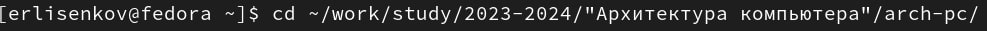{#fig:001 width=70%}

Обновляю локальный репозиторий с помощью команды git pull (Из. 2).

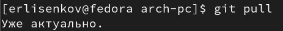{#fig:002 width=70%}

Изображение 2 | Обновление локального репозитория

Перехожу в каталог отчёта лабораторной №3 (Из. 3).

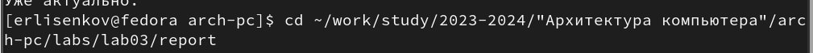{#fig:003 width=70%}

Изображение 3 | Переход в каталог

Компилирую шаблон с использованием Makefile, введя команду make    (Из. 4).

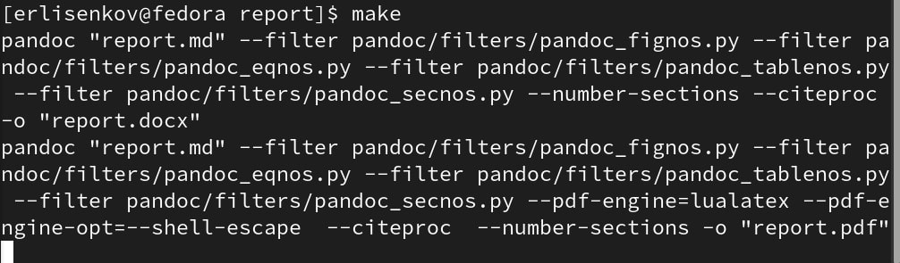{#fig:004 width=70%}

Открываю файл .docx и .pdf для проверки качества выполнения команд  (Из. 5), (Из. 6).

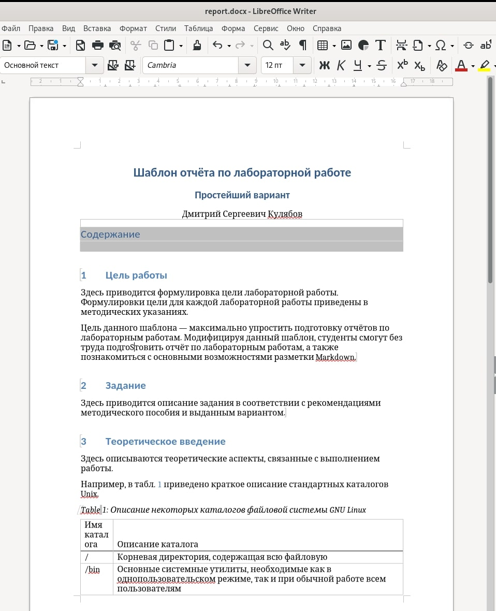{#fig:005 width=70%}

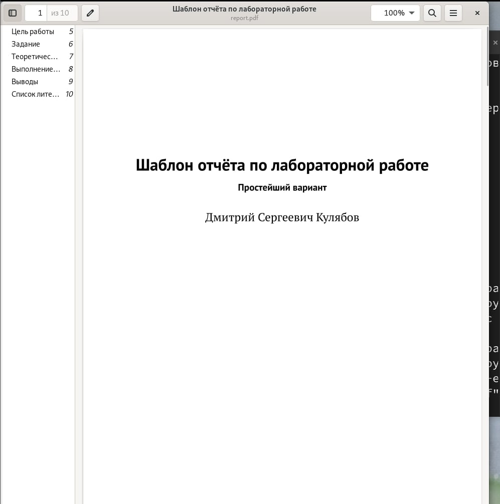{#fig:006 width=70%}

Далее выполняю команду make clean, чтобы удалить недавно созданные  файлы. С помощью команды ls проверяю нахождение их в папке, их там не   оказалось (Из. 7).

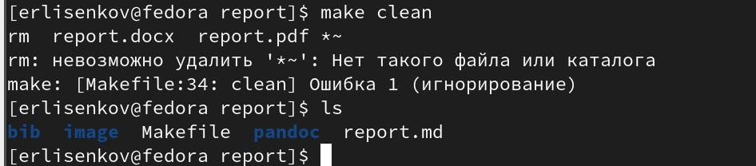{#fig:007 width=70%}	

Открываю файл report.md с помощью текстового редактора и проверяю   данные внутри (Из. 8)

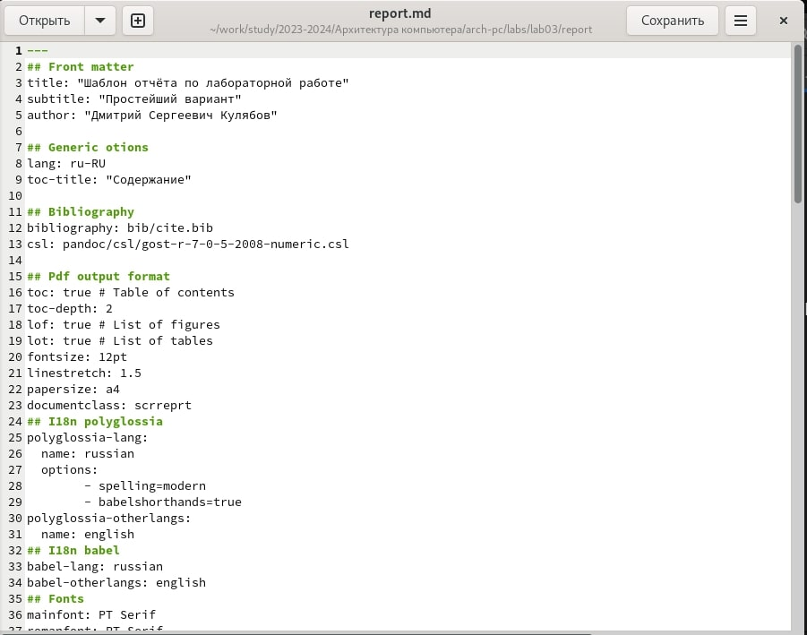{#fig:008 width=70%}	

	
Далее меняю название у файла на ЛО2_Лисенков_отчёт и приступаю к заполнению отчёта (Из. 9).

{#fig:009 width=70%}	

Далее выгружаю всё на GitHub (Из. 10).

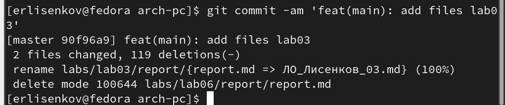{#fig:010 width=70%}	

1.3 Задания самостоятельной работы.

№1

Выполню переход в lab02/report с помощью команды cd (Из. 11).

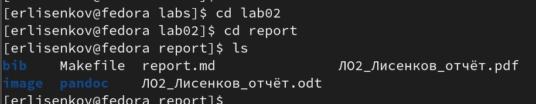{#fig:011 width=70%}

Выполню копию файла report.md с новым названием (Из. 12).

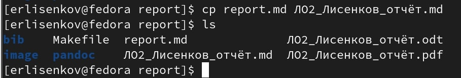{#fig:012 width=70%}

Открою новый файл и заполню отчёт (Из. 13).

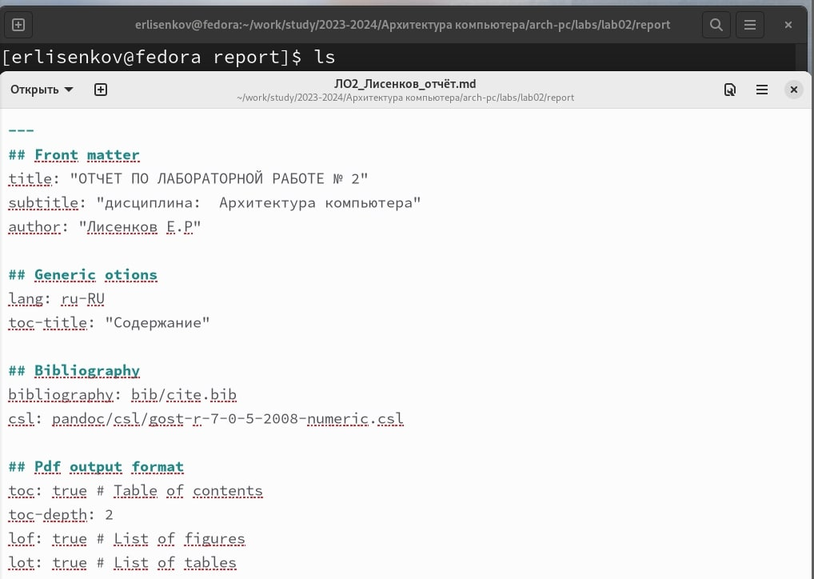{#fig:013 width=70%}

Удаляю предыдущие файлы, для того, чтобы они мне не мешали в дальнейшей работе (Из. 14).

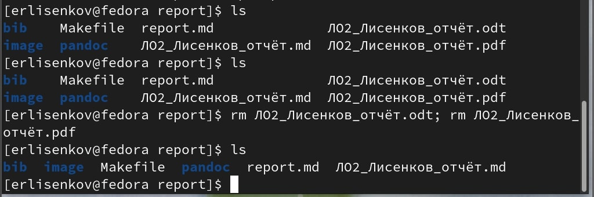{#fig:014 width=70%}

Компилирую файлы с отчётом по лабораторной работе (Из. 15).

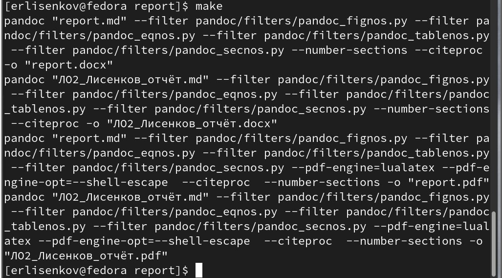{#fig:015 width=70%}

№2

Удаляю лишние сгенерированные файлы report.docx и report.pdf, с помощью команд rm report.docx; rm report.pdf и проверяю правильность выполнения команд  (Из. 16). 

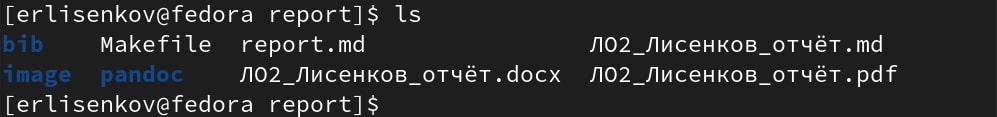{#fig:016 width=70%}

Добавлю изменения на GitHub с помощью команды git add и сохраню изменения на сервере с помощью команды git commit -m “Add files” (Из. 17).

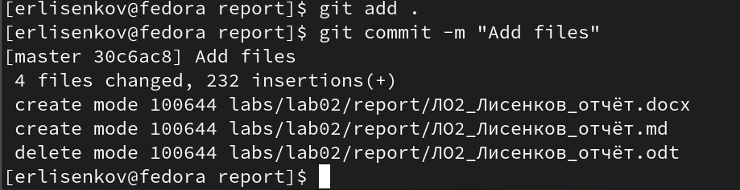{#fig:017 width=70%}

Отправляю изменения (Из. 18).

{#fig:018 width=70%}

# Выводы

Благодаря этой лабораторной работе я понял как работать с языком разметки MarkDown.

# Список литературы

Приложение к лабораторной работе №3.

