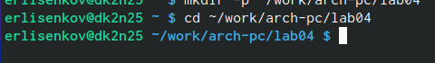
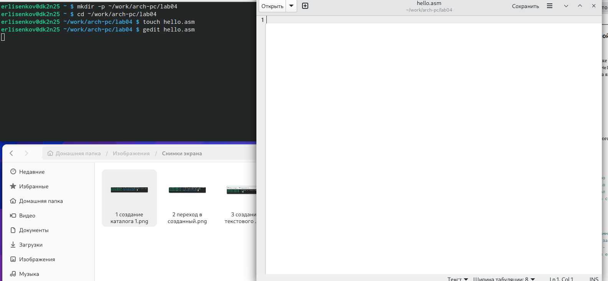
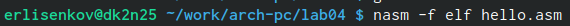
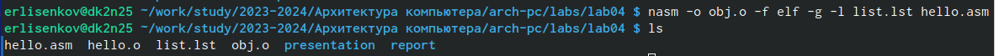
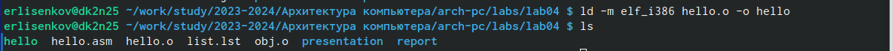
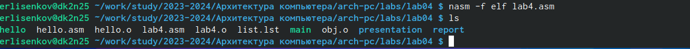
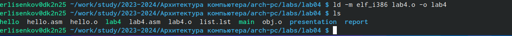
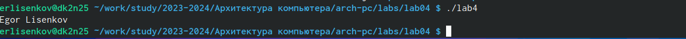
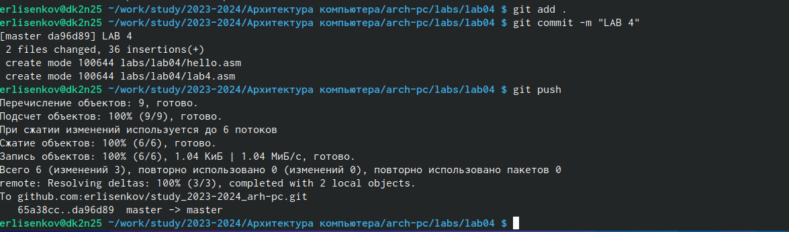

---
## Front matter
title: "ОТЧЕТ ПО ЛАБОРАТОРНОЙ РАБОТЕ # 4"
subtitle: "дисциплина: Архитектура компьютера"
author: "Лисенков Егор Романович"

## Generic otions
lang: ru-RU
toc-title: "Содержание"

1 Цель работы
2 Задание 
3 Теоретическое введение 
4 Выполнение лабораторной работы
4.2 Транслятор NASM
4.3 Работа с расширенным синтаксисом командной строки NASM
4.4 Работа с компоновщиком LD
4.5 Запуск программы
4.6 Задания для проверки
Выводы
Список литературы.

## Bibliography
bibliography: bib/cite.bib
csl: pandoc/csl/gost-r-7-0-5-2008-numeric.csl

## Pdf output format
toc: true # Table of contents
toc-depth: 2
lof: true # List of figures
lot: true # List of tables
fontsize: 12pt
linestretch: 1.5
papersize: a4
documentclass: scrreprt
## I18n polyglossia
polyglossia-lang:
  name: russian
  options:
	- spelling=modern
	- babelshorthands=true
polyglossia-otherlangs:
  name: english
## I18n babel
babel-lang: russian
babel-otherlangs: english
## Fonts
mainfont: PT Serif
romanfont: PT Serif
sansfont: PT Sans
monofont: PT Mono
mainfontoptions: Ligatures=TeX
romanfontoptions: Ligatures=TeX
sansfontoptions: Ligatures=TeX,Scale=MatchLowercase
monofontoptions: Scale=MatchLowercase,Scale=0.9
## Biblatex
biblatex: true
biblio-style: "gost-numeric"
biblatexoptions:
  - parentracker=true
  - backend=biber
  - hyperref=auto
  - language=auto
  - autolang=other*
  - citestyle=gost-numeric
## Pandoc-crossref LaTeX customization
figureTitle: "Список иллюстраций"
tableTitle: "Цель работы"
listingTitle: "Задания"
lofTitle: "Теоретическое введение"
lotTitle: "Выполнение лабораторной работы"
4.2 Транслятор NASM
4.3 Работа с расширенным синтаксисом командной строки NASM
4.4 Работа с компоновщиком LD
4.5 Запуск программы
4.6 Задания для проверки

lolTitle: "Выводы"
lolTitle: "Список Литературы"
## Misc options
indent: true
header-includes:
  - \usepackage{indentfirst}
  - \usepackage{float} # keep figures where there are in the text
  - \floatplacement{figure}{H} # keep figures where there are in the text
---

# 1 Цель работы

Главной целью данной работы является приобретение навыков работы с языком
программирование ассеблер NASM.

# 2 Задание

1. Создание программы Hello world!
2. Работа с транслятором NASM
3. Работа с расширенным синтаксисом командной строки NASM
4. Работа с компоновщиком LD
5. Запуск исполняемого файла
6. Выполнение заданий для самостоятельной работы.

# 3 Теоретическое введение

Основными функциональными элементами любой ЭВМ являются центральный процессор, память и периферийные устройства. Взаимодействие этих устройств осуществляется через общую шину, к которой они подключены. Физически шина представляет собой большое количество проводников, соединяющих устройства друг с другом. В современных компьютерах проводники выполнены в виде электропроводящих дорожек на материнской плате. Основной задачей процессора является обработка информации, а также организация координации всех узлов компьютера. В состав центрального процессора входят следующие устройства: - арифметико-логическое устройство (АЛУ) — выполняет логические и арифметические действия, необходимые для обработки информации, хранящей ся в памяти; - устройство управления (УУ) — обеспечивает управление и контроль всех устройств компьютера; - регистры — сверхбыстрая оперативная память небольшого объёма, входящая в состав процессора, для временного хранения промежуточных результатов выполнения инструкций; регистры процесс ора делятся на два типа: регистры общего назначения и специальные регистры. Для того, чтобы писать программы на ассемблере, необходимо знать, какие регистры процессора существуют и как их можно использовать. Большинство команд в программах написанных на ассемблере используют регистры в качеств е операндов. Практически все команды представляют собой преобразование данных хранящихся в регистрах процессора, это например пересылка данных между регистрами или между регистрами и памятью, преобразование (арифметические или логические 6 операции) данных хранящихся в регистрах. Доступ к регистрам осуществляется не по адресам, как к основной памяти, а по именам. Каждый регистр процессора архитектуры x86 имеет свое название, состоящее из 2 или 3 букв латинского алфавита. В качестве примера приведем названия основных регистров общего назначения (именно эти регистры чаще всего используются при написании программ): - RAX, RCX, RDX, RBX, RSI, R DI — 64-битные - EAX, ECX, EDX, EBX, ESI, EDI — 32-битные - AX, CX, D X, BX, SI, DI — 16-битные - AH, AL, CH, CL, DH, DL, BH, BL — 8-битные 6 Другим важным узлом ЭВМ является оперативное запоминающее устройство (ОЗУ). ОЗУ — это быстродействующее энергозависимое запоминающее устройст во, которое напрямую взаимодействует с узлами процессора, предназначенное для хранения программ и данных, с которыми процессор непосредственно работ ает в текущий момент. ОЗУ состоит из одинаковых пронумерованных ячеек пам яти. Номер ячейки памяти — это адрес хранящихся в ней данных. Периферийн ые устройства в составе ЭВМ: - устройства внешней памяти, которые предназна чены для долговременного хранения больших объёмов данных. - устройства ввода-вывода, которые обеспечивают взаимодействие ЦП с внешней средой. В основе вычислительного процесса ЭВМ лежит принцип программного управления. Это означает, что компьютер решает поставленную задачу как после довательность действий, записанных в виде программы. Коды команд представляют собой многоразрядные двоичные комбинации из 0 и 1. В коде машинной команды можно выделить две части: операционную и адресную. В операционной части хранится код команды, которую необходимо выполнить. В адресной части хранятся данные или адреса данных, которые участвуют в выполнении данной операции. При выполнении каждой команды процессор выполняет определённую последовательность стандартных действий, которая называется командным циклом процессора. Он заключается в следующем: 1. формирование адреса в памяти очередной команды; 2. считывание кода команды из памяти и её дешифрация; 3. выполнение команды; 4. переход к 7 следующей команде. Язык ассемблера (assembly language, сокращённо asm) — машинно-ориентированный язык низкого уровня. NASM — это открытый проект ассемблера, версии которого доступны под различные операционные системы и который позволяет получать объектные файлы для этих систем. В NASM используется Intel-синтаксис и поддерживаются инструкции x86-64. 7

# 4 Выполнение лабораторной работы

Создаю каталог для работы с программами, с помощью команды
mkdir -p ~/work/arch-pc/lab04. (рис. @fig:001).

{#fig:001 width=70%}

Выполню переход в созданный каталог (рис. @fig:002).

{#fig:002 width=70%}

Создам файл hello.asm и затем открою его. (рис. @fig:003) (рис. @fig:004).

{#fig:003 width=70%}

{#fig:004 width=70%}

Выполню редактирование и напишу код для языка Assembler NASM. (рис. @fig:005).

{#fig:005 width=70%}

# 4.2 Транслятор NASM

Превращаю текст программы для вывода “Hello world!” в объектный код с
помощью транслятора NASM, используя команду nasm -f elf hello.asm, ключ -f
указывает транслятору nasm, что требуется создать бинарный файл в формате ELF
(рис. @fig:006).

{#fig:006 width=70%}

# 4.3 Работа с расширенным синтаксисом командной строки NASM

Ввожу команду для компиляции файла из hello.asm в obj.o, также там будут
содержаться ключи отладки и с помощью ключа -l создам файл листинга list.lst (рис. @fig:007). Также для собственного удобства работы с программой я перенёс все файлы в ~/work/study/2023-2024/”Архитектура компьютера”/arch-pc/labs/lab04.

{#fig:007 width=70%}

# 4.4 Работа с компоновщиком LD

Передаю объектный файл hello.o на обработку компоновщику LD, чтобы
по лучить исполняемый файл hello (рис. @fig:008).

{#fig:008 width=70%}

Выпоняю команду далее, которая создаст исполняемый файл main, т.к
После ключа -о было задано значение main. Теперь же объектный файл имеет
имя obj.o (рис. @fig:009).

{#fig:009 width=70%}

# 4.5 Запуск программы

Произвожу запуск файла, который исполнит код (рис. @fig:010).

{#fig:010 width=70%}

# 4.6 Задания для проверки

Создам копию в текущем файл из файла с именес hello.asm в lab4.asm
(рис. @fig:011).

{#fig:011 width=70%}

Далее с помощью текстового редактора меняю данные в файле lab4.asm (рис. @fig:012).

{#fig:012 width=70%}

Далее компилирую созданный файл в объектный файл (рис. @fig:013).

{#fig:013 width=70%}

Выполню передачу файла объектного файла lab4.o на обработку
компановщика LD (рис. @fig:014).

{#fig:014 width=70%}

Выполню запуск программы (рис. @fig:015).

{#fig:015 width=70%}

После всей проделанной работы выполню отправку файлов в собственный
репозиторий GitHub (рис. @fig:016).

{#fig:016 width=70%}

# Выводы

Данное занятие помогло мне понять принцип работы с языком
программирования Assembler NASM.

# Список литературы{.unnumbered}

https://esystem.rudn.ru/pluginfile.php/2089084/mod_resource/content/0/Лабораторная%20
работа%20№4.%20Создание%20и%20процесс%20обработки%20программ%20на%20
языке%20ассемблера%20NASM.pdf

::: {#refs}
:::
