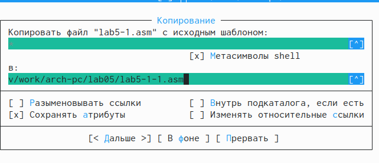

---
## Front matter
title: "ОТЧЕТ по лабораторной работе № 5"
subtitle: "дисциплина:	Архитектура компьютера"
author: "Студент: Лисенков Е.Р."

## Generic otions
lang: ru-RU
toc-title: "Содержание"

## Bibliography
bibliography: bib/cite.bib
csl: pandoc/csl/gost-r-7-0-5-2008-numeric.csl

## Pdf output format
toc: true # Table of contents
toc-depth: 2
lof: true # List of figures
lot: true # List of tables
fontsize: 12pt
linestretch: 1.5
papersize: a4
documentclass: scrreprt
## I18n polyglossia
polyglossia-lang:
  name: russian
  options:
	- spelling=modern
	- babelshorthands=true
polyglossia-otherlangs:
  name: english
## I18n babel
babel-lang: russian
babel-otherlangs: english
## Fonts
mainfont: PT Serif
romanfont: PT Serif
sansfont: PT Sans
monofont: PT Mono
mainfontoptions: Ligatures=TeX
romanfontoptions: Ligatures=TeX
sansfontoptions: Ligatures=TeX,Scale=MatchLowercase
monofontoptions: Scale=MatchLowercase,Scale=0.9
## Biblatex
biblatex: true
biblio-style: "gost-numeric"
biblatexoptions:
  - parentracker=true
  - backend=biber
  - hyperref=auto
  - language=auto
  - autolang=other*
  - citestyle=gost-numeric
## Pandoc-crossref LaTeX customization
tableTitle: "Цель работы"
listingTitle: "Задание"
lofTitle: "Теоретическое введение"
lotTitle: "Выполнение лабораторной работы"
lotTitle: "1 Основы работы с mc."
lotTitle: "2 Структура программы на языке ассемблера NASM."
lotTitle: "3 Подключение внешнего файла."
lotTitle: "4 Выполнение заданий."
lolTitle: "Выводы"
lolTitle: "Список литературы"
## Misc options
indent: true
header-includes:
  - \usepackage{indentfirst}
  - \usepackage{float} # keep figures where there are in the text
  - \floatplacement{figure}{H} # keep figures where there are in the text
---

# Цель работы

Целью данной лабораторной работы является приобретение практических навыков работы в Midnight Commander, освоение инструкций языка ассемблера mov и int.

# Задания

1.Основы работы с mc 

2.Структура программы на языке ассемблера NASM 

3.Подключение внешнего файла 

4.Выполнение заданий для самостоятельной работы

# Теоретическое введение

Midnight Commander (или просто mc) — это программа, которая позволяет просматривать структуру каталогов и выполнять основные операции по управлению файловой системой, т.е. mc является файловым менеджером. Midnight Commander позволяет сделать работу с файлами более удобной и наглядной. Программа на языке ассемблера NASM, как правило, состоит из трёх секций: секция кода программы (SECTION .text), секция инициированных (известных во время компиляции) данных (SECTION .data) и секция неинициализированных данных (тех, под которые во время компиляции только отводится память, а значение присваивается в ходе выполнения программы) (SECTION .bss). Для объявления инициированных данных в секции .data используются директивы DB, DW, DD, DQ и DT, которые резервируют память и указывают, какие значения должны храниться в этой памяти: - DB (define byte) — определяет переменную размером в 1 байт; - DW (define word) — определяет переменную размеров в 2 байта (слово); - DD (define double word) — определяет переменную размером в 4 байта (двойное слово); - DQ (define quad word) — определяет переменную размером в 8 байт (учетве- рённое слово); - DT (define ten bytes) — определяет переменную размером в 10 байт. Директивы используются для объявления простых переменных и для объявления массивов. Для определения строк принято использовать директиву DB в связи с особенностями хранения данных в оперативной памяти. Инструкция языка ассемблера mov предназначена для дублирования данных источника в приёмнике. 

mov dst,src 

Здесь операнд dst — приёмник, а src — источник. В качестве операнда могут выступать регистры (register), ячейки памяти (memory) и непосредственные значения (const). Инструкция языка ассемблера intпредназначена для вызова прерывания с указанным номером. 

int n 

Здесь n — номер прерывания, принадлежащий диапазону 0–255. При программировании в Linux с использованием вызовов ядра sys_calls n=80h (принято задавать в шестнадцатеричной системе счисления).

# Выполнение лабораторной работы

## 1 Основы работы с mc.

Открываю Midnight Commander с помощью команды mc (рис. @fig:001).

{#fig:001 width=70%}

Перехожу в каталог ~/work/arch-pc (рис. @fig:002).

{#fig:002 width=70%}

С помощью функциональной клавиши F7 создаю папку lab05, прописываю
команду touch lab5-1.asm (рис. @fig:003).

{#fig:003 width=70%}

## 2 Структура программы на языке ассемблера NASM.

С помошью функциональной клавишы F4 открою файл для редактирования в редакторе nano (рис. @fig:004).

{#fig:004 width=70%}

Введу в файл код программы для запроса строки у пользователя (рис. @fig:005).

{#fig:005 width=70%}

Функциональная клавиша  F3  поможет нам открыть файл для просмотра, чтобы проверить содержание на наличие текста программы (рис. @fig:006).

{#fig:006 width=70%}

Выполню трансляцию своей программы с помощью команд и запущу её:

nasm -f elf lab5-1.asm (транслировал текст файла в объектный файл)

ld -m elf_i386 -o lab5-1 lab5-1.o (выполню компановку файла).

./lab5-1 (Запускаю программу этой командой) (рис. @fig:007).

{#fig:007 width=70%}

## 3.Подключение внешнего файла

На ТУИС загружаю файл и проверяю, что он был загружен в папку загрузки (рис. @fig:008).

{#fig:008 width=70%}

Выполню копирование файла c помощью клавиши F5 in_out.asm из каталога Загрузки в lab06 (рис. @fig:009).

{#fig:009 width=70%}

Исправляю текст программы и включаю в работу подпрограммы из 
внешнего файла in_out.asm. Для изменений используем редактор nano. Я 
извиняюсь, но я, к сожалению забыл сделать ТОЛЬКО этот скриншот. 
Прикрепляю код, который должен быть тут:

%include 'in_out.asm'    	; подключение внешнего файла 

SECTION .data           	; Секция инициированных данных 

msg: DB 'Введите строку: ',0h        ; сообщение
 
SECTION   .bss          	; Секция не инициированных данных
 
buf1: RESB 80         	; Буфер размером 80 байт 

SECTION .text         	; Код программы 

GLOBAL _start 	; Начало программы 

_start: 		; Точка входа в программу 

mov  eax, msg 	; запись адреса выводимого сообщения в `EAX` 

call   sprint 	; вызов подпрограммы печати сообщения 

mov  ecx, buf1 	; запись адреса переменной в `EAX` 

mov  edx, 80 	; запись длины вводимого сообщения в `EBX`

call  sread 	; вызов подпрограммы ввода сообщения 

call  quit 	; вызов подпрограммы завер

Выполню компоновку кода и запущу программу (рис. @fig:010).

{#fig:010 width=70%}

Разница заключается в том, что программа запрашивает текст без переноса на новую строку (как было в прошлой программе).

# Выполнение заданий

№1 Создам копию файла lab5-1.asm (использую клавишу F5). (рис. @fig:011).

{#fig:011 width=70%}

Выполню изменения в коде (с помощью клавиши F4) (рис. @fig:012).

{#fig:012 width=70%}

№2 Выполняем компоновку и запускаем программу.(рис. @fig:013).

{#fig:013 width=70%}

№3 Создам копию файла lab5-2.asm (использую клавишу F5). (рис. @fig:014).

{#fig:014 width=70%}

Исправляю код программы и включаю в работу внешний файл in_out.asm. (рис. @fig:015).

{#fig:015 width=70%}

№4 Выполню компоновку и запускаю программу (рис. @fig:016).

{#fig:016 width=70%}

# Выводы

По итогу выполнения этой лабораторной работы я смог приобрести практические знания, которые однозначно пригодятся мне в работе с языками программирования.

# Список литературы

Лабораторная работа №5. Основы работы с Midnight Commander (mc). Структура программы на языке ассемблера NASM. Системные вызовы в ОС GNU Linux
