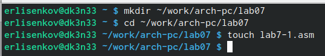

---
## Front matter
title: "Отчёт по лабораторной работе №7"
subtitle: "Дисциплина: архитектура компьютеров и операционные системы"
author: "Лисенков Егор Романович"

## Generic otions
lang: ru-RU
toc-title: "Содержание"

## Bibliography
bibliography: bib/cite.bib
csl: pandoc/csl/gost-r-7-0-5-2008-numeric.csl

## Pdf output format
toc: true # Table of contents
toc-depth: 2
lof: true # List of figures
lot: true # List of tables
fontsize: 12pt
linestretch: 1.5
papersize: a4
documentclass: scrreprt
## I18n polyglossia
polyglossia-lang:
  name: russian
  options:
	- spelling=modern
	- babelshorthands=true
polyglossia-otherlangs:
  name: english
## I18n babel
babel-lang: russian
babel-otherlangs: english
## Fonts
mainfont: PT Serif
romanfont: PT Serif
sansfont: PT Sans
monofont: PT Mono
mainfontoptions: Ligatures=TeX
romanfontoptions: Ligatures=TeX
sansfontoptions: Ligatures=TeX,Scale=MatchLowercase
monofontoptions: Scale=MatchLowercase,Scale=0.9
## Biblatex
biblatex: true
biblio-style: "gost-numeric"
biblatexoptions:
  - parentracker=true
  - backend=biber
  - hyperref=auto
  - language=auto
  - autolang=other*
  - citestyle=gost-numeric
## Pandoc-crossref LaTeX customization
figureTitle: "Рис."
tableTitle: "Таблица"
listingTitle: "Листинг"
lofTitle: "Список иллюстраций"
lotTitle: "Список таблиц"
lolTitle: "Листинги"
## Misc options
indent: true
header-includes:
  - \usepackage{indentfirst}
  - \usepackage{float} # keep figures where there are in the text
  - \floatplacement{figure}{H} # keep figures where there are in the text
---

# Цель работы

Изучение команд условного и безусловного переходов. Приобретение навыков написания
программ с использованием переходов. Знакомство с назначением и структурой файла
листинга.

# Задание

1. Реализация переходов в NASM.
2. Изучение структуры файлы листинга.
3. Задания для самостоятельной работы.

# Теоретическое введение

Для реализации ветвлений в ассемблере используются так называемые команды передачи
управления или команды перехода. Можно выделить 2 типа переходов:

• условный переход – выполнение или не выполнение перехода в определенную точку
программы в зависимости от проверки условия.

• безусловный переход – выполнение передачи управления в определенную точку программы без каких-либо условий.

Безусловный переход выполняется инструкцией jmp. Инструкция cmp является одной из инструкций, которая позволяет сравнить операнды и
выставляет флаги в зависимости от результата сравнения.
Инструкция cmp является командой сравнения двух операндов и имеет такой же формат,
как и команда вычитания.

Листинг (в рамках понятийного аппарата NASM) — это один из выходных файлов, создаваемых транслятором. Он имеет текстовый вид и нужен при отладке программы, так как
кроме строк самой программы он содержит дополнительную информацию.

# Выполнение лабораторной работы

## **Реализация переходов в NASM**

Создаю каталог для программ № 7, перехожу в него и создаю файл lab7-1.asm. (рис. @fig:001).

{#fig:001 width=70%}

Ввожу в файл lab7-1.asm текст программы из листинга 7.1. (рис. @fig:001).

{#fig:001 width=70%}

Создаю исполняемый файл и запускаю его. (рис. @fig:001).

{#fig:001 width=70%}

Использование инструкции jmp _label2 меняет порядок исполнения
инструкций и позволяет выполнить инструкции начиная с метки _label2, пропустив вывод
первого сообщения.

Изменю программу таким образом, чтобы она выводила сначала ‘Сообщение № 2’, потом ‘Сообщение № 1’ и завершала работу. Для этого ввожу команду из листинга. (рис. @fig:001).

{#fig:001 width=70%}

Создаю исполняемый файл и проверяю его работу. (рис. @fig:001).

{#fig:001 width=70%}

Затем изменяю текст программы, добавив в начале программы jmp _label3, jmp _label2 в конце метки jmp _label3, jmp _label1 добавляю в конце метки jmp _label2, и добавляю jmp _end в конце метки jmp _label1, (рис. @fig:001).

{#fig:001 width=70%}

чтобы вывод программы был следующим: (рис. @fig:001).

{#fig:001 width=70%}

Рассмотрим программу, которая определяет и выводит на экран наибольшую из 3 целочисленных переменных: A,B и C. Значения для A и C задаются в программе, значение B вводиться с клавиатуры.

Создаю файл lab7-2.asm в каталоге ~/work/arch-pc/lab07. (рис. @fig:001).

{#fig:001 width=70%}

Текст программы из листинга 7.3 ввожу в lab7-2.asm. (рис. @fig:001).

{#fig:001 width=70%}

Создаю исполняемый файл и проверьте его работу. (рис. @fig:001).

{#fig:001 width=70%}

Всё работает хорошо.

## **Изучение структуры файлы листинга**

Создаю файл листинга для программы из файла lab7-2.asm. (рис. @fig:001).

{#fig:001 width=70%}

Открываю файл листинга lab7-2.lst с помощью текстового редактора и внимательно изучаю его формат и содержимое. (рис. @fig:001).

{#fig:001 width=70%}

В представленных трех строчках содержаться следующие данные: (рис. @fig:001).

{#fig:001 width=70%}

"2" - номер строки кода, "; Функция вычисления длинны сообщения" - комментарий к коду, не имеет адреса и машинного кода.

"3" - номер строки кода, "slen" - название функции, не имеет адреса и машинного кода.

"4" - номер строки кода, "00000000" - адрес строки, "53" - машинный код, "push ebx" - исходный текст программы, инструкция "push" помещает операнд "ebx" в стек.

Открываю файл с программой lab7-2.asm и в выбранной мной инструкции с двумя операндами удаляю выделенный операнд. (рис. @fig:001).

{#fig:001 width=70%}

Выполняю трансляцию с получением файла листинга. (рис. @fig:001).

{#fig:001 width=70%}

На выходе я не получаю ни одного файла из-за ошибки:инструкция mov 
(единственная в коде содержит два операнда) не может работать, имея только один операнд, из-за чего нарушается работа кода.

## **Задания для самостоятельной работы**

1. Пишу программу нахождения наименьшей из 3 целочисленных переменных a, b и c.
Значения переменных выбираю из табл. 7.5 в соответствии с вариантом, полученным
при выполнении лабораторной работы № 7. Мой вариант под номером 13, поэтому мои значения - 84, 32, 77 (рис. @fig:001).

{#fig:001 width=70%}

Создаю исполняемый файл и проверяю его работу, подставляя необходимые значение. (рис. @fig:001).

{#fig:001 width=70%}

2. Пишу программу, которая для введенных с клавиатуры значений х и а вычисляет
значение и выводит результат вычислений заданной для моего варианта функции f(x):

a - 7, если a >= 7

a*x, если a < 7

(рис. @fig:001).

{#fig:001 width=70%}

Создаю исполняемый файл и проверяю его работу для значений х и а соответственно: (3;9), (6;4). (рис. @fig:001).

{#fig:001 width=70%}

# Выводы

Благодаря этой лабораторной работе, я закрепил свои знания в работе в программирование ветвлений.

# Список литературы

1. Лабораторная работа №7. Команды безусловного и условного переходов в Nasm. Программирование ветвлений.
